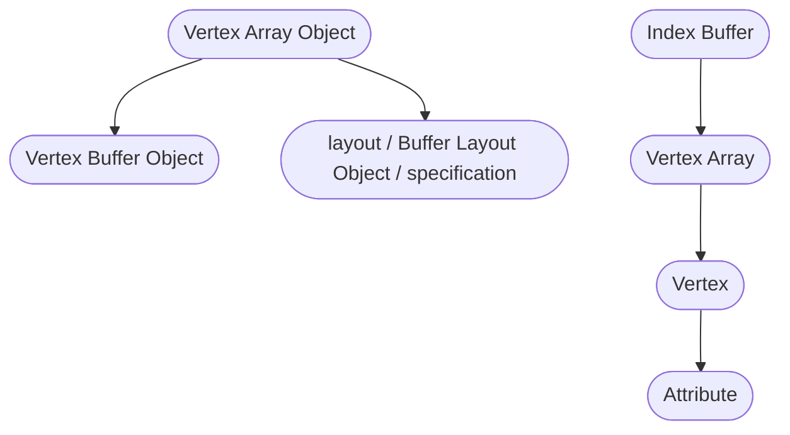

# Mike's OpenGL Notes

- `immediate mode` and `display lists` old/deprecated in favor of `VAO`s and `VBO`s
- `OpenGL Compatibility Profile` is default unless you specify `Core Profile`
- attributes are the individual items contained within a vertice
- vertice is more than position/coordinates attributes; can include normals, texture UVs, and other data
- vertex shader is called per-vertice in vertex buffer
- fragment shader is called per-pixel of shape size on screen
- a single gl function can return multiple errors; therefore you must call `glGetError()` until it returns empty, every time
- `gl4/glDebugMessageCallback` is superior alternative to `glGetError()`
- uniforms are set per draw call

---
## VAOs & VBOs

