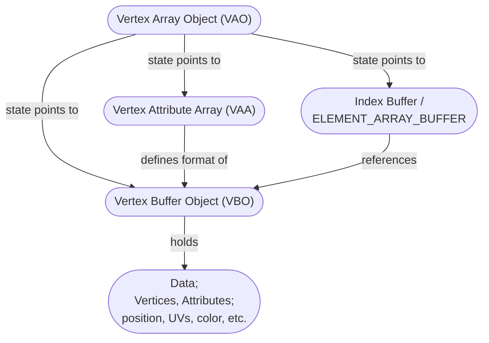

# Mike's OpenGL Notes

- `immediate mode` and `display lists` old/deprecated in favor of `VAO`s and `VBO`s
- attributes are the individual items contained within a vertice
- vertice is more than position/coordinates attributes; can include normals, texture UVs, and other data
- vertex shader is called per-vertice in vertex buffer
- fragment shader is called per-pixel of shape size on screen
- a single gl function can return multiple errors; therefore you must call `glGetError()` until it returns empty, every time
- `gl4/glDebugMessageCallback` is superior alternative to `glGetError()`
- uniforms are set per draw call
- `COMPAT_PROFILE` means recycling one default/global VAO for everything; this is the default profile for backward-compatibility. `CORE_PROFILE` means defining as many VAOs as you like. Changing VAOs is fewer-calls/optimal/easier/faster than otherwise changing the VAAs + VBOs + IBs many times per frame.
- `Index Buffer` is part of `VAO` state, if managed correctly. see: https://stackoverflow.com/a/53002289

---
## VAOs & VBOs

